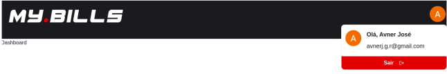
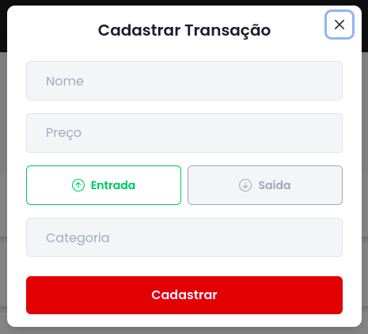
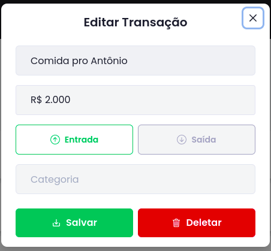
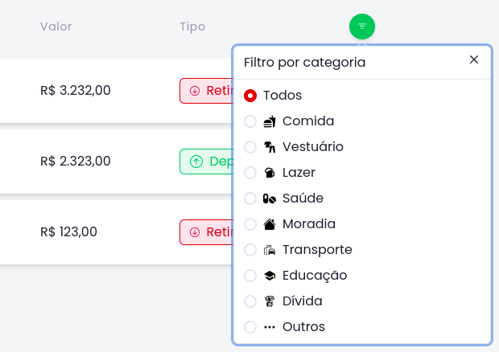

# My Bills 402

## Caso de uso #1

### Logar o usuário

Autor: Usuário do Site

Fluxo Normal:
- Entrar na tela de login
- Clicar no botão de login
- Escolher uma conta do Google
- Usuário redirecionado para dashboard

<h1 align="center">

</h1>

## Caso de uso #2 

### Deslogar o usuário

Autor: Usuário do site

Fluxo normal:
- Acessar qualquer página com header
- Clicar na imagem de avatar
- Clicar no botão de sair
- Usuário redirecionado para tela de login

<h1 align="center">

</h1>

## Caso de uso #3
### Criar transação

Autor: Usuário do site

Fluxo normal:

- Acessar pagina de transações
- Clicar em Nova Transação
- Colocar o nome da Transação
- Colocar o valor da Transação
- Selecionar se a transação é de entrada ou de saida
- Colocar a categoria da transação
- Clicar em cadastrar

<h1 align="center">

</h1>

## Caso de uso #4
### Editar transação

Autor: Usuário do site

Fluxo normal: 
- Acessar pagina de transações
- Clicar no ícone de editar da transação escolhida
- Alterar os dados que deseja
- Clicar em salvar

<h1 align="center">

</h1>
  
## Caso de uso #5
### Deletar transação

Autor: Usuário do site

Fluxo normal:

- Acessar pagina de transações
- Clicar no ícone de editar da transação escolhida
- Clicar em deletar

<h1 align="center">

</h1>

## Caso de uso #6

### Filtrar transações por categoria

Autor: Usuário do site

Fluxo normal:
  - Acessar a página de transações
  - Clicar no ícone de filtro
  - Selecionar uma categoria 

<h1 align="center">

</h1>

## Caso de uso #7 

### Filtrar transações por mês

Autor: Usuário do site

Fluxo normal: 
  - Acessar alguma página com o header disponível
  - Clicar no select de mês
  - Selecionar um mês desejado
  
## Caso de uso #8 

### Gerar gráficos das transações

Autor: Usuário do site

Fluxo normal:
  - Acessar a página de dashboard
  - Gráficos de acordo com os gastos e depósitos são gerados
  